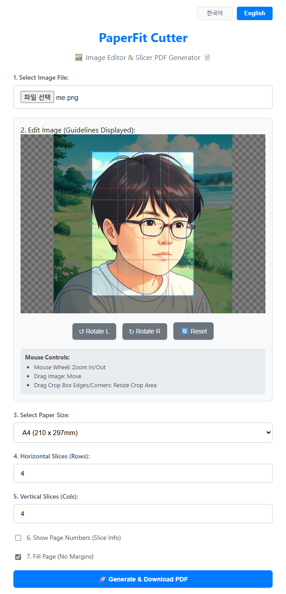

# **✂️ PaperFit Cutter: 이미지 편집 및 분할 PDF 생성기 (Image Editor & Slicer PDF Generator)**

PaperFit Cutter는 이미지를 원하는 용지 크기에 맞춰 편집하고, 여러 장으로 분할하여 PDF로 만드는 웹 도구입니다. 포스터 제작이나 큰 이미지 인쇄 시 유용합니다. 모든 작업은 웹 브라우저에서 바로 실행됩니다.  
(PaperFit Cutter is a web tool that allows you to easily edit images to fit your desired paper size, slice them into multiple pages, and create a PDF. It's useful for creating posters or printing large images. All operations are performed directly in your web browser.)  

### ✨ [**PaperFit Cutter 바로 사용해보기 (Try PaperFit Cutter Live)**](https://junwoo-seo-1998.github.io/PaperFitCutter/) ✨

## **🖼️ 스크린샷 (Screenshots)**

## **🛠️ 사용 라이브러리 (Libraries Used)**

* [Cropper.js](https://fengyuanchen.github.io/cropperjs/): 이미지 자르기 및 편집 기능 제공 (Provides image cropping and editing features)  
* [jsPDF](https://parall.ax/products/jspdf): PDF 생성 기능 제공 (Provides PDF generation features)

## **🧑‍💻 개발자 및 후원 (Developer & Support)**

안녕하세요\! Junwoo Seo입니다. 이 도구가 도움이 되셨다면, 커피 한 잔 어떠세요? 😊  
(Hello\! I'm Junwoo Seo. If you find this tool helpful, how about buying me a coffee? 😊)  
프로젝트가 마음에 드셨다면 GitHub에서 ⭐ Star를 눌러주세요\!  
(If you like this project, please give it a ⭐ Star on GitHub\!)  
문의나 버그 리포트는 GitHub Issues로 부탁드립니다.  
(For inquiries or bug reports, please use GitHub Issues.)  
Copyright © 2024 Junwoo Seo. All Rights Reserved.